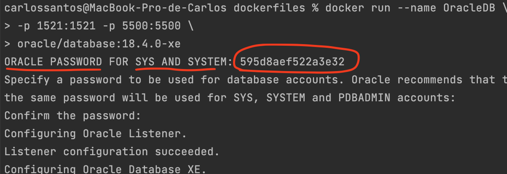

# Oracle Database container images

Sample container build files to facilitate installation, configuration, and environment setup for DevOps users. For more information about Oracle Database please see the [Oracle Database Online Documentation](https://docs.oracle.com/en/database/oracle/oracle-database/index.html).

## How to build and run

This project offers sample Dockerfiles for:

* Oracle Database 18c (18.4.0) Express Edition (XE)

To assist in building the images, you can use the [buildContainerImage.sh](SingleInstance/dockerfiles/buildContainerImage.sh) script. See below for instructions and usage.

The `buildContainerImage.sh` script is just a utility shell script that performs MD5 checks and is an easy way for beginners to get started. Expert users are welcome to directly call `docker build` or `podman build` with their preferred set of parameters.

### Building Oracle Database container image

    [carlossantos@MacBook-Pro-de-Carlos dockerfiles]% ./buildContainerImage.sh -x -v 18.4.0
    
    Use 'docker scan' to run Snyk tests against images to find vulnerabilities and learn how to fix them

    Oracle Database container image for 'xe' version 18.4.0 is ready to be extended:

    --> oracle/database:18.4.0-xe

    Build completed in XXX seconds.

### Running Oracle Database in a container

#### Running Oracle Database 18c Express Edition in a container

To run your Oracle Database 18c Express Edition container image use the `docker run` command as follows:

        docker run --name OracleDB \
        -p 1521:1521 -p 5500:5500 \
        oracle/database:18.4.0-xe
    
    Parameters:
       --name:        The name of the container (default: auto generated)
       -p:            The port mapping of the host port to the container port.
                      Two ports are exposed: 1521 (Oracle Listener), 5500 (EM Express)
       -e ORACLE_PWD: The Oracle Database SYS, SYSTEM and PDB_ADMIN password (default: auto generated)
       -e ORACLE_CHARACTERSET:
                      The character set to use when creating the database (default: AL32UTF8)
       -v /opt/oracle/oradata
                      The data volume to use for the database.
                      Has to be writable by the Unix "oracle" (uid: 54321) user inside the container!
                      If omitted the database will not be persisted over container recreation.
       -v /opt/oracle/scripts/startup | /docker-entrypoint-initdb.d/startup
                      Optional: A volume with custom scripts to be run after database startup.
                      For further details see the "Running scripts after setup and on startup" section below.
       -v /opt/oracle/scripts/setup | /docker-entrypoint-initdb.d/setup
                      Optional: A volume with custom scripts to be run after database setup.
                      For further details see the "Running scripts after setup and on startup" section below.

**IMPORTANT:** The resulting images will be an image with the Oracle binaries installed. On first startup of the container a new database will be created, the following lines highlight when the database is ready to be used:

    #########################
    DATABASE IS READY TO USE!
    #########################

You may extend the image with your own Dockerfile and create the users and tablespaces that you may need.

The character set for the database is set during creating of the database. 11gR2 Express Edition supports only UTF-8. You can set the character set for the Standard Edition 2 and Enterprise Edition during the first run of your container and may keep separate folders containing different tablespaces with different character sets.

Once the container has been started and the database created you can connect to it just like to any other database:

    sqlplus sys/<your password>@//localhost:1521/XE as sysdba
    sqlplus system/<your password>@//localhost:1521/XE
    sqlplus pdbadmin/<your password>@//localhost:1521/XEPDB1

The Oracle Database inside the container also has Oracle Enterprise Manager Express configured. To access OEM Express, start your browser and follow the URL:

    https://localhost:5500/em/

On the first startup of the container a random password will be generated for the database if not provided. You can find this password in the output line:

    ORACLE PASSWORD FOR SYS AND SYSTEM:

**Note:** The ORACLE_SID for Express Edition is always `XE` and cannot be changed, hence there is no ORACLE_SID parameter provided for the XE build.

The password for those accounts can be changed via the `docker exec` command. **Note**, the container has to be running:

    docker exec <container name> /opt/oracle/setPassword.sh <your password>

## Copyright

Copyright (c) 2014,2021 Oracle and/or its affiliates.
